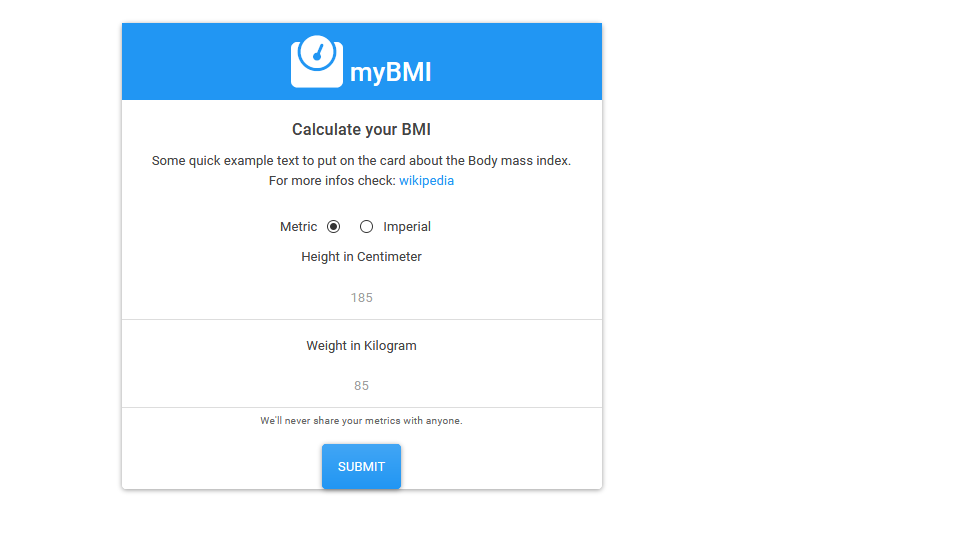

## BMI Calculator in JavaScript

[live version on github pages](https://sprachmensch.github.io/JS_BMI/)

* Features:
  * VanillaJS
  * Calculate BMI either in imperial or metric
  * ~130 LOC of js
  * Uses [Bootswatch](http://bootswatch.com/)
  * Uses [FontAwesome](http://fontawesome.com/)
  

